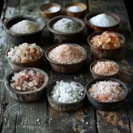

# Butterball Cookies

## Ingredients

| Ingredient | Quantity |
|------------|----------|
| Butter | 1 cup |
| Powdered Sugar | 1/2 cup |
| Vanilla Extract | 1 tsp |
| Flour  | 2 cup |
|Walnuts, Chopped | 3/4 cup|
|Salt | 1/4 tsp|

## Instructions

1. Cream butter, sugar, vanilla 
2. slowly add flour and salt until combined 
3. Mix in walnuts 
4. Shape into balls 
5. Bake for 10 min, watch to ensure bottoms dont brown too much 

*From the Kitchen of: Charlotte Capaul (Grandma Lottie)*

