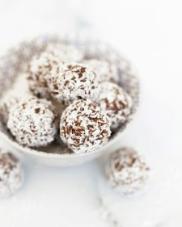

# Coconut Rum Balls

## Ingredients

| Ingredient | Quantity |
|------------|----------|
| Vanilla Wafters | 12 oz package / 3 cups finely crushed  |
| Flaked Coconut | 3.5 oz  + extra for rolling|
| Nuts | 1 cup   |
|Sweetened Condensed Milk | 14 oz|
|Rum | 1/4 cup|

## Instructions

1. In a large bowl combine waffer crumbs, coconut, and nuts 
2. Add sweetened consensed milk and rum 
3. Chill for 4 hours 
4.Shape into 1" balls 
5. Roll in coconut flakes 
6. Store in the fridge 

*From the Kitchen of: LeaAnn Van Lohuizen*

