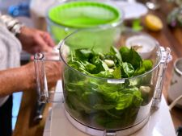

# Fresh Pesto

## Ingredients

| Ingredient | Quantity |
|------------|----------|
| Fresh Basil | 2 cups |
| Parmesan or Romono | 1/2 cup|
| Olive Oil | 1/2 cup |
| Pine Nuts | 1/3 cup|
|Garlic | 3 cloves |
Salt and pepper

## Instructions

1. Pulse basil and pine nuts in a food processor
2. Add garlic and pulse again
3. Slowly add olive oil in a stream into the processor
4. Add cheese and pulse
5. Add salt and Pepper. Taste and adjust

*From the Kitchen of: LeaAnn Van Lohuizen*

