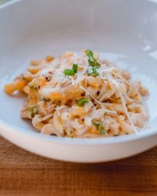

# Mac n Cheese

## Ingredients

| Ingredient | Quantity |
|------------|----------|
| Butter | 1 Tbs |
| Flour | 1 Tbs |
| Milk | 1/2 cup |
| Cheese | 1/2 cup|
| Dry Pasta | 1/2 bag/box
Season to taste

## Instructions

1. Boil Pasta 
2. Brown the roux
3. Whisk in milk. Cook until it begins to thicken
4. Add cheese little by little until fully melted
5. Season to taste

*From the Kitchen of: Brooke Van Lohuizen*

