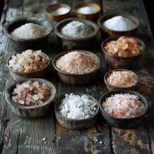

# No Bake Cookies

## Ingredients

| Ingredient | Quantity |
|------------|----------|
| Sugar | 2 cups |
| Unsweetened Cocoa Powder | 3 Tbs |
|Butter | 1/2 cup|
|Milk| 1/2 cup |
|Oats | 3 cups |
| Peanut Butter | 1/2 cup|
| Vanilla Extract | 1 tsp|

## Instructions

1. In a sauce pan bring sugar, cocoa, butter, milk to a rapid boil for 1 minute
2. Remove from heat, add oats, peanut butter, and vanilla. Mix well.
3. Quickly drop spoonfuls onto waxed paper
4. Let cool

*From the Kitchen of: LeaAnn Van Lohuizen*

