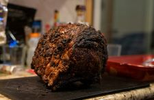

# Prime Rib

## Ingredients

| Ingredient | Quantity |
|------------|----------|
| Prime Rib Roast | 3 - 10 lbs |
Salt and pepper

## Instructions

1. Pre-heat oven to 375*
2. Put seasoned roast uncovered into the over for 1 hour
3. Turn oven off and DO NOT OPEN
4. Turn oven on 1 hour before serving to 375*
5. Leave roast in 50 minutes
6. Let rest 10 minutes before carving

*From the Kitchen of: LeaAnn Van Lohuizen*

