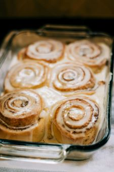

# Grandma Kathy's Rolls & Cinnamon Rolls

## Ingredients

| Ingredient | Quantity |
|------------|----------|
| Flour | 8 cups |
| Potato Flakes | 1/2 cup |
| Salt | 1 tsp |
| Rapid Rise Yeast  | 2 packets |
|Oil | 1/2 cup |
| Eggs | 2 eggs|
|Hot Water | 3 cups|

## Instructions

1. Pre-heat oven to 350*
1. Combine 3 cups of flour and all other dry ingredients, mix well
2. Add hot water, beat 2 minutes until smooth
3. Add oil and eggs and beat 2 more minutes
4. Slowly in small amounts add 5-6 cups of flour
5. Let rise 1 hour
6. Divide into 4 lumps, roll out to form rolls or cinnamon rolls
7. Let rise again another hour
8. Bake for 15-20 minutes  
-----
1. Roll out dough flat
2. Spread butter, cinnamon, and sugar
3. Add nuts and/or raisins
4. Roll up and pinch seam
5. Cut with strong thread/floss
6. Put buns in greased pan and let rise 20 minutes
7. Bake 15-20 minutes until golden brown
8. Let cool and frost with cream cheese frosting

*From the Kitchen of: Kathy Nickerson (Grandma Kathy)*

