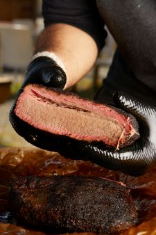

# Sous Vide Smoked Brisket

## Ingredients

| Ingredient | Quantity |
|------------|----------|
| Black Pepper | 1/3 cup |
| Salt | 1/4 cup |
| Brisket | 5 lbs |
| liquid Smoke | 1/4 tsp|

## Instructions

1. Combine pepper and salt in a small bowl. Rub two-thirds of mixture evenly over surface of brisket. Reserve remaining one-third of mixture. Slice brisket in half crosswise in order to fit into large vacuum bags.
2. Add 1/8 tsp liquid smoke to the vacuum bags with brisket
2. Set your sous vide to 135 degrees for brisket with a tender steak-like texture, or 155 degrees for more traditionally textured brisket that falls apart when you pull at it. Add brisket to water bath and cover it with a lid. Cook for 24 to 36 hours at 155 degrees or 36 to 72 hours at 135 degrees.  Allow cooked brisket to cool at least to room temertature before proceeding.
3. Place brisket in smoker and maintain tempurature between 275 and 300. Smoke until a deep, dark bark has formed, about 3 hours
4. Transfer brisket to a cutting board and tent with foil. Allow to rest until the tempurature drops between 145 and 165, about 30 minures. Slice against the grain into thin strips.

*From the Kitchen of: Daniel Sasser*

